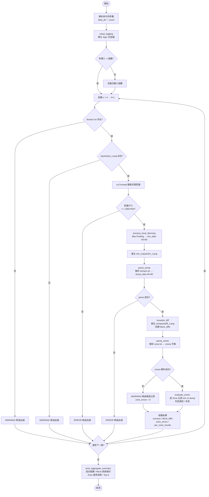

# Local Dimming Alignment Validator

顯示器 Local Dimming（局部背光控制）LED 驅動驗證工具。

## 專案說明

本工具用於驗證 Local Dimming 控制器的 LED 點亮邏輯是否正確，透過比較：

- **硬體 Dump**：從硬體讀出的實際 LED 亮度資料（`.txt` dump 檔）
- **模擬結果**：以輸入影像經 Max-Pooling 運算所推算出的預期 LED 狀態

工具會在 Block 層級與 Zone 層級分別進行比對，標記所有異常（漏亮 / 多亮）並輸出彙總統計。

---

## 目錄結構

```
local dimming/
├── local_dimming_align.py   # 主程式
├── zone.txt                 # 30 個 LED Zone 的座標定義
├── input/                   # 輸入灰階影像 (input_0.png ... input_N.png)
├── dump/                    # 硬體 Dump txt 檔 (0.txt ... N.txt)
├── LED/                     # LED 亮滅資料 (0.log ... N.log)
├── compare/                 # 比對結果影像輸出
├── sim_output/              # 模擬輸出影像 (sim_0.png ... sim_N.png)
└── logs/                    # 執行日誌 (帶時間戳)
```

---

## 輸入格式

### 影像
- 路徑：`input/input_{N}.png`
- 規格：1280×640 灰階影像

### Dump 檔（支援兩種格式）

**新格式**（Tab 分隔）：
```
[0]	0	0x2000'8f1c	UCHAR
[1]	128	0x2000'8f1d	UCHAR
```

**舊格式**（無分隔符）：
```
[168]1750x2000'8fc4UCHAR
```

> 每個 Dump 檔預期包含 3200 筆資料（40×80 Grid）。

### Zone 定義（`zone.txt`）
```
case 0:
  j_start = 4; j_end = 10; i_start = 0; i_end = 14;
```
- `j` 對應 row（垂直方向，範圍 0–39）
- `i` 對應 column（水平方向，範圍 0–79）

### LED 資料（`LED/{N}.log`）
每行一筆，共 30 筆（對應 30 個 Zone 的 LED 亮滅值）。

---

## 核心邏輯

| 步驟 | 說明 |
|------|------|
| Max-Pooling | 1280×640 影像 → 40×80 Grid（每格 16×16 像素取最大值）|
| Block 比對 | 逐格比較 Dump 與模擬結果，統計差異數量 |
| Zone 比對 | 依 Zone 座標計算最大亮度；與 LED 資料比對，判定漏亮 / 多亮 |

**漏亮（Missing Light）**：模擬應亮，硬體未亮  
**多亮（Extra Light）**：模擬應滅，硬體多亮

---

## 執行方式

```bash
python local_dimming_align.py
```

互動式輸入 test case 目錄路徑與數量，工具自動處理全部 case 並輸出彙總報告。

### 輸出範例

```
========== 彙總統計 ==========
成功處理 case 數: 28 / 30
總 Block 誤差: 1579
總 Zone 錯誤: 115

--- Zone 錯誤分佈 ---
Zone ID  | 漏亮  | 多亮  | 合計
---------|-------|-------|------
Zone 0   |   0   |  28   |   28
Zone 1   |   0   |  28   |   28
...

--- Top-5 Block 誤差最高 Case ---
Case 5   : 87 block diffs
...
```

---

## 程式流程圖



---

## 環境需求

```
Python >= 3.8
opencv-python
numpy
```

安裝：
```bash
pip install opencv-python numpy
```

---

## 打包為執行檔（Windows）

使用 PyInstaller 將主程式打包為獨立 `.exe`，無需安裝 Python 即可執行。

### 建置步驟

```bash
pip install pyinstaller
build.bat
```

建置完成後 `local_dimming_validator.exe` 直接輸出至專案根目錄（與 `zone.txt` 同層）：

```
local dimming/
├── local_dimming_validator.exe   # 單一執行檔，約 55 MB
├── zone.txt
├── input/
├── dump/
├── LED/
├── compare/      (自動建立)
├── sim_output/   (自動建立)
└── logs/         (自動建立)
```

### 部署方式

將以下檔案複製至目標機器同一資料夾，直接執行 `.exe` 即可，無需安裝 Python：

- `local_dimming_validator.exe`
- `zone.txt`
- `input/`、`dump/`、`LED/`

```cmd
local_dimming_validator.exe [data_dir] [-c COUNT]
```

---

## 注意事項

- 輸入影像不會被覆寫；模擬結果另存至 `sim_output/`
- 日誌檔以 UTC+8 時間戳命名，保存於 `logs/`
- Dump 檔若少於 3200 筆，工具會警告但繼續處理

---

## 版本紀錄 (Changelog)

### v1.7.0 — 2026-04-28

**新增 Windows 執行檔打包支援**

- 新增 `local_dimming_align.spec`（PyInstaller 設定檔）
- 新增 `build.bat`（一鍵建置腳本）
- `.gitignore` 新增排除 `build/`、`dist/` 建置產物
- README 新增打包步驟與部署說明

---

### v1.6.0 — 2026-04-28

**同步獨立腳本與新增 README 流程圖**

- `visualize_diff.py` 同步主程式邏輯：顏色定義（紅=漏亮、藍=多亮）、Max-Pooling 取樣、向量化運算、舊格式 Dump 支援、消除魔法數字
- README 新增 Mermaid 程式流程圖

---

### v1.5.0 — 2026-04-27

**程式碼品質重構**

- 移除未使用的死碼 `parse_led_dump`（zone 評估已改用 dump 資料，LED 檔解析函式不再需要）
- 修正舊格式 Dump 支援：新增無分隔符格式的備用正規表達式（`[idx]value0x...`），舊格式不再靜默失敗
- 消除魔法數字 `3200`：改用 `GRID_H * GRID_W` 確保與網格常數一致
- 新增輸入影像尺寸驗證：尺寸不符時提早返回並記錄錯誤，避免網格偏移
- 彙整報告只列有異常的測試組，消除大量零錯誤雜訊行
- 效能優化：`process_local_dimming`、`visualize_diff`、`sim_out_img` 三處雙層迴圈改為 NumPy 向量化運算

---

### v1.4.0 — 2026-04-27

**比對邏輯重構與術語調整**

- 修正燈區比對邏輯：`evaluate_zones` 改以 `ucDet_APL_Rot`（dump）為硬體實際依據，不再使用 LED log（`ucDet_APL`）
- 修正 compare 圖顏色定義：紅色 = 漏亮（模擬有、dump 沒），藍色 = 多亮（模擬沒、dump 有）
- LED 資料副檔名由 `.txt` 改為 `.log`
- 術語「錯亮」統一更名為「多亮」

---

### v1.3.0 — 2026-04-21 (commit `5bb3d7a`)
**更新 Zone 定義**

- 修改 `zone.txt` 中 30 個 LED Zone 的座標定義

---

### v1.2.0 — 2026-04-21 (commit `53ef9b7`)
**新增程式碼內嵌中文註解**

- 為 `local_dimming_align.py` 所有主要函式加上中文說明註解，提升可讀性

---

### v1.1.0 — 2026-04-21 (commit `3ea8b14`)
**彙整報告改為以測試組（Test Group）為單位統計**

- **之前**：`print_aggregate_summary()` 依 Zone ID 累積所有測試組的錯誤次數。
  例：Zone 0 的 `多亮` 欄位會將 30 組中所有把 Zone 0 標為多亮的次數加總（最高可達 28），
  導致報告數字與單組 Zone 報告不一致，難以對應。
- **之後**：彙整表改為依 **Test Group** 編號顯示，每列代表該測試組內的總漏亮 / 多亮數量，
  與各組 `--- 燈區 (Zone) 點亮比對報告 ---` 的輸出直接對應。

**輸出範例（新）**：
```
各測試組燈區錯誤次數：
   zone    漏亮    多亮   Total
  ----------------------------------
       0       0       1       1
       1       0       0       0
       2       1       2       3
       ...
```

---

### v1.0.0 — 2026-04-21 (commit `bd62264`)
初始版本，功能包含：
- 1280×640 灰階影像 → 40×80 Max-Pooling Grid
- Block 層級差異比對與視覺化 (`compare/diff_N.png`)
- Zone 層級漏亮 / 多亮比對（依 `zone.txt` 定義）
- 批次處理 30 組測試資料，輸出彙總統計與 Top-5 Block 誤差排名
- 自動安裝依賴套件（`opencv-python`、`numpy`）
- 執行日誌帶時間戳，保存於 `logs/`
